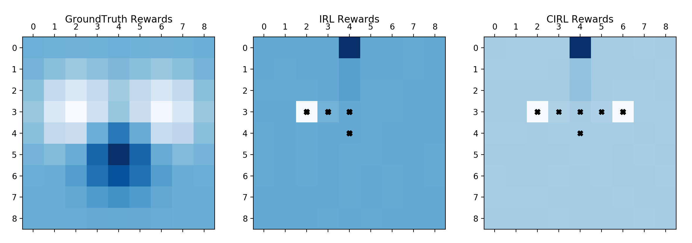

# Cooperative Inverse Reinforcement Learning

This repository work done at AISC3 towards replicating and extending CIRL ([paper](https://arxiv.org/abs/1606.03137)).

The implementations of IRL are taken from [neka-nat](https://github.com/neka-nat/inv_rl) and the environments are created in OpenAI [gym](https://gym.openai.com/docs/) 

## Implemented Algorithms

* LP IRL
* Maximum Entropy IRL
* Maximum Entropy Deep IRL
* CIRL with MaxEnt

## Reward Map

## Requirements

* OpenAI gym
* numpy
* scipy
* chainer
* matplotlib